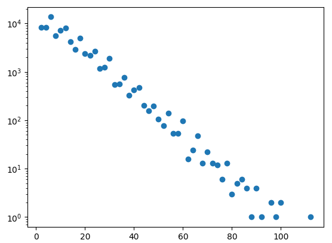
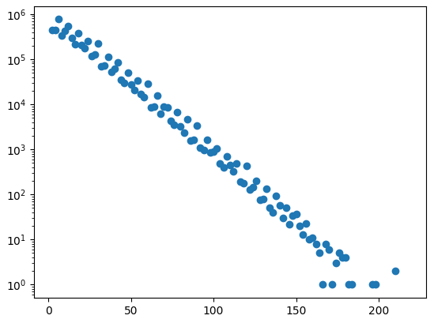
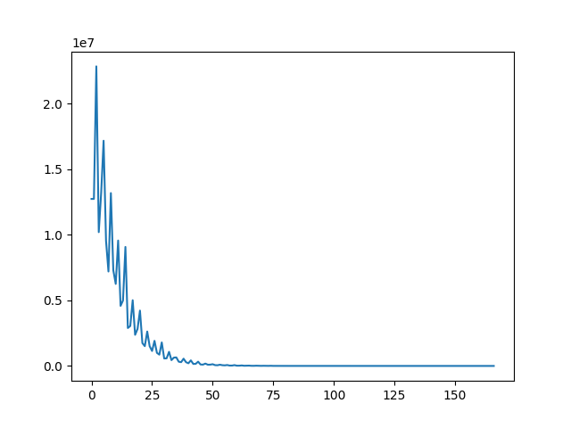
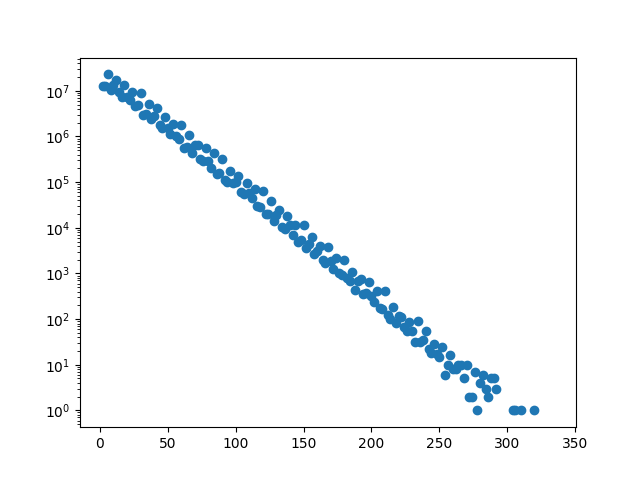
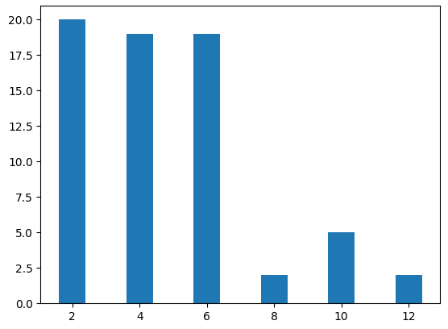

# Prime Gaps Line

Create a logarithmic plot of the frequency of gaps between primes up to an arbitrary number.

This was inspired by the the video of Stand-up Maths:

https://youtu.be/SMsTXQYgbiQ

For the log line he calculated the gaps for the first 150,000,000 primes (minute 18:40) This should be able to calcutate within 300 seconds in Python according to my graph https://github.com/kreier/prime

Based on an article by Kerry D. Wong from 2009: 

http://www.kerrywong.com/2009/09/06/an-alternative-illustration-of-prime-number-distribution/

## Graph up to 1 million



This was created in a Jupyter Notebook in 1.5 seconds with the following code:

``` py
import matplotlib.pyplot as plt
import math, time, cpuinfo
import random

last  = 1000000        # 4294967295 is the limit for unsigned 32bit, 2147483647
found = 4              # we start from 11, know 2, 3, 5, 7
primes = [3, 5, 7]     # exclude 2 since we only test odd numbers
frequency = [0] * 100  # should be fine for 100 or gaps of 200

def is_prime(number):
    flag_prime = 1
    for divider in range(3, int(math.sqrt(number)) + 1, 2):
        if number % divider == 0:
            flag_prime = 0
            break
    return flag_prime

def find_primes(largest):
    global primes, found
    for number in range(11, largest + 1, 2):
        if is_prime(number) > 0:
            found += 1
            primes.append(number)

def is_prime_fast(number):
    flag_prime = True
    largest_divider = int(math.sqrt(number)) + 1
    for divider in primes:
        if number % divider == 0:
            flag_prime = False
            break
        if divider > largest_divider:
            break
    return flag_prime

def elapsed_time(seconds):
    hours = int(seconds/3600)
    minutes = int(seconds/60 - hours*60)
    sec = int(seconds - minutes*60 - hours*3600)
    return(f"{hours}h {minutes}min {sec}s")

print(f"Calculating prime numbers to {last} in Python with algorithm v5.4.2024")
print(f"Running on a {cpuinfo.get_cpu_info()['brand_raw']}")
start = time.perf_counter_ns()
dot = start
column = 0    
largest_divider = int(math.sqrt(last))
if largest_divider % 2 == 0:
    largest_divider += 1
print(f'First find prime divisors up to {largest_divider}.')
find_primes(largest_divider)
print(f'Found {found} primes, now use them als divisors.')
frequency[0] = 1    # gap of 2 between 5 and 7
last_prime = 7
for number in range(9, last, 2):
  if is_prime_fast(number):
    gap = number - last_prime
    location = int(gap/2 - 1)
    frequency[location] += 1
    found += 1
    last_prime = number
duration = (time.perf_counter_ns() - start)/1000000000
print(f"This took: {duration:.9f} seconds. {elapsed_time(duration)}")
print(f"I found {found} prime numbers. Should be 78498.")

for i in range(len(frequency) - 1, 1, -1):
  if frequency[i] > 0:
    highest = i
    break

frequency = frequency[0:highest]
plt.plot(frequency)
plt.show()

gapsize = []

for i in range(highest):
  gapsize.append(int((i+1)*2))

plt.scatter(gapsize, frequency)
plt.yscale('log')
plt.show()
```

## Compare graph to 1 million and 100 million

 

## And further to 4 billion - 2E32, the largest 32bit integer

It took my i3-10100 some 20 hours to finish the calculation in python.

 

## Most common gap size - the jumping champion

For one million the most common gap size is 6. And it has been since around 500. But until then the champion is jumping between 1, 2, 4 and 6 several times. I have to write a program to visualize it, and it will look like here:

https://mathworld.wolfram.com/JumpingChampion.html

https://math.berkeley.edu/~molsson/Goldston.pdf Graph on page 67 for the champions 2, 4 and 6

And on slide 92 a champion distribution for 2310.

https://t5k.org/glossary/page.php?sort=JumpingChampion


## My old finding - not correct, just kept it here for documentation

Until 367 the most common gapsize is 2, having appeared 20 times. With 373 and 379 the gapsize 6 appeared 21 times and is taking over the lead until $1.74 \times 10^{35}$ 



The most common distance changes with larger prime numbers:

- 2 until 373 (20x), with 379 it is 6
- 6 until $1.74 \times 10^{35}$ 
- 30 until $10^{425}$
- 210 much later, and is then taking over by 
- 2310 

Which follows the pattern or sequence:

With the sequence
- $p_1 = 2 = 2$
- $p_2 = 6 = 2 \times 3$
- $p_3 = 30 = 2 \times 3 \times 5$
- $p_4 = 210 = 2 \times 3 \times 5 \times 7$
- $p_5 = 2310 = 2 \times 3 \times 5 \times 7 \times 11$

https://arxiv.org/abs/1408.4505 Kevin Ford, Ben Green, Sergei Konyagin, Terence Tao (20 Aug 2014)
https://arxiv.org/abs/1408.5110 James Maynard (1 day later on 21 Aug 2014)
